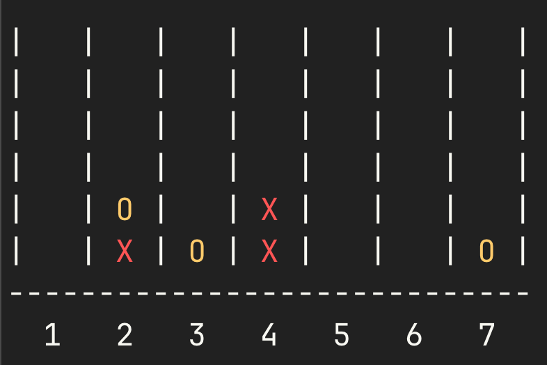

# Connect Four - C++ (OOP)

## Description
This is a simple **Connect Four** game implemented in C++ using **Object-Oriented Programming (OOP)** principles. The game runs in the terminal and allows two players to take turns dropping discs into a grid. The first player to align four discs in a row, column, or diagonal wins!

## Features
- **Object-Oriented Design**: Encapsulated logic with `Board`, `Game`, and `Player` classes.
- **Colorful Terminal Output**: `X` (Red) and `O` (Yellow) are displayed in color.
- **Win Detection**: Checks for horizontal, vertical, and diagonal wins.
- **Valid Moves Handling**: Ensures players can only drop discs in available columns.
- **Tie Detection**: Declares a tie if the board is full with no winner.

## Installation
### Prerequisites
- **C++ Compiler** (GCC, Clang, or MSVC)

## Compilation and Execution
### Using Terminal
To compile and run manually:
```sh
 g++ -std=c++17 -o connect_four main.cpp Game.cpp Board.cpp Player.cpp && ./connect_four
```

## How to Play
1. Run the program. 
2. Players take turns choosing a column (1-7) to drop their disc.
3. The first to align **four** symbols in a row, column, or diagonal **wins**!
4. If the board is full with no winner, it's a **tie**.

## Example Output


## Author
**Alex Fougeroux** - March 2025

